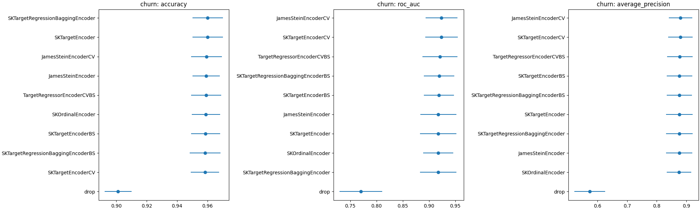

# Benchmarks for Target Encoder

Benchmarks for different forms of target encoder with 10-fold cross validation.

## Datasets

| data_name         |   categorical features |   n_features |   n_samples | is_classification   | openml_url                     |
|:------------------|-----------------------:|-------------:|------------:|:--------------------|:-------------------------------|
| telco             |                     16 |           19 |        7043 | True                | https://www.openml.org/d/42178 |
| amazon_access     |                      9 |            9 |       32769 | True                | https://www.openml.org/d/4135  |
| kicks             |                     18 |           32 |       72983 | True                | https://www.openml.org/d/41162 |
| churn             |                      4 |           20 |        5000 | True                | https://www.openml.org/d/40701 |
| dresses_sales     |                     11 |           12 |         500 | True                | https://www.openml.org/d/23381 |
| phishing_websites |                     30 |           30 |       11055 | True                | https://www.openml.org/d/4534  |

## Results





## How to run benchmarks

0. Clone repo:

```bash
git clone http://github.com/thomasjpfan/sk_encoder_cv
cd sk_encoder_cv
```

1. Create virtualenv and install `sk_encoder_cv`

```bash
conda create -n sk_encoder_cv python=3.8  # or use venv
conda activate sk_encoder_cv
python setup.py develop
```

2. Run single benchmarks:

```bash
python benchmark.py --cv 5 --n-jobs 8 single adult
```

3. Or run all benchmarks

```bash
python benchmark.py --cv 5 --n-jobs 8 all
```

The results will be written into the `results` directory.

4. Generate README report:

```bash
python generate_report.py
```
