# Benchmarks for Target Encoder

Benchmarks for different forms of target encoder with 10-fold cross validation.

## Datasets

| data_name               |   categorical features |   n_features |   n_samples | is_classification   | openml_url                     |
|:------------------------|-----------------------:|-------------:|------------:|:--------------------|:-------------------------------|
| telco                   |                     16 |           19 |        7043 | True                | https://www.openml.org/d/42178 |
| amazon_access           |                      8 |            8 |       32769 | True                | https://www.openml.org/d/4135  |
| kicks                   |                     18 |           32 |       72983 | True                | https://www.openml.org/d/41162 |
| dresses_sales           |                     11 |           12 |         500 | True                | https://www.openml.org/d/23381 |
| phishing_websites       |                     30 |           30 |       11055 | True                | https://www.openml.org/d/4534  |
| SpeedDating             |                     61 |          120 |        8378 | True                | https://www.openml.org/d/40536 |
| medical_charges_nominal |                      8 |           11 |      163065 | False               | https://www.openml.org/d/42559 |
| Bike_Sharing_Demand     |                      4 |           12 |       17379 | False               | https://www.openml.org/d/42712 |
| delays_zurich_transport |                      5 |           17 |       27327 | False               | https://www.openml.org/d/42495 |
| black_friday            |                      4 |            9 |      166821 | False               | https://www.openml.org/d/41540 |
| colleges                |                     17 |           49 |        7063 | False               | https://www.openml.org/d/42159 |
| KDDCup09_upselling      |                     38 |          230 |       50000 | True                | https://www.openml.org/d/1114  |
| KDDCup09_appetency      |                     38 |          230 |       50000 | True                | https://www.openml.org/d/1111  |
| rl                      |                     14 |           22 |       31406 | True                | https://www.openml.org/d/41160 |
| sf-police-incidents     |                      5 |            8 |     2215023 | True                | https://www.openml.org/d/42732 |

## Results

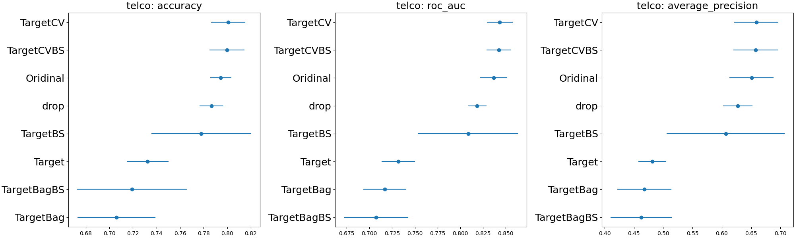
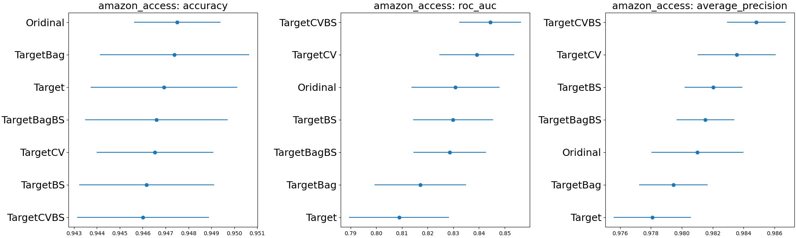

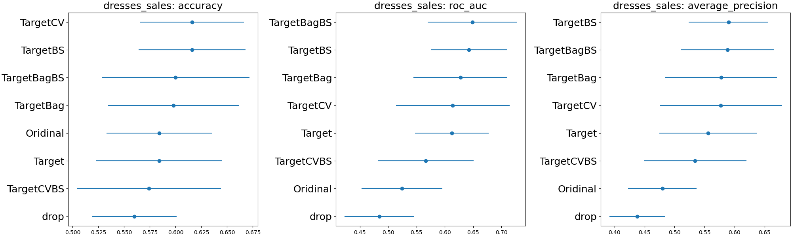
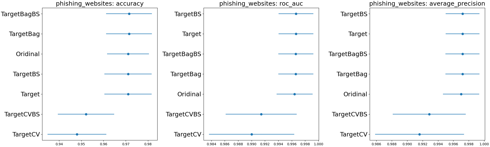
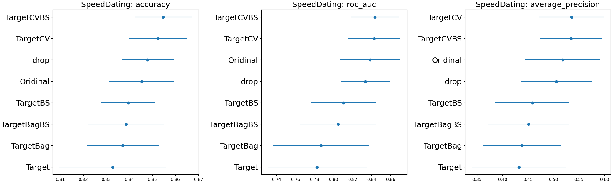
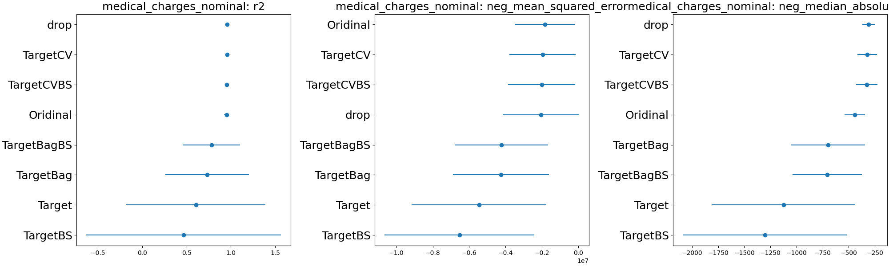
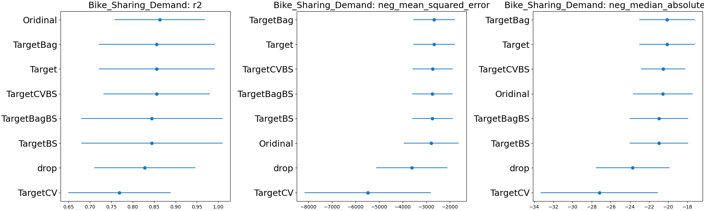
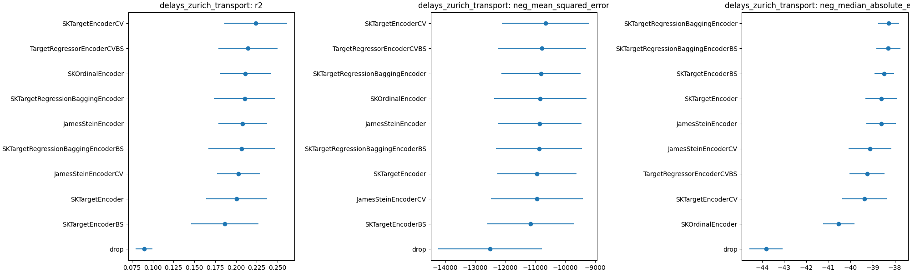
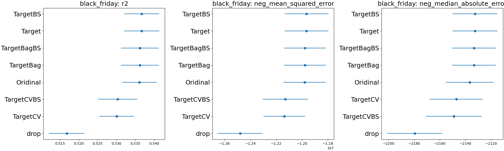
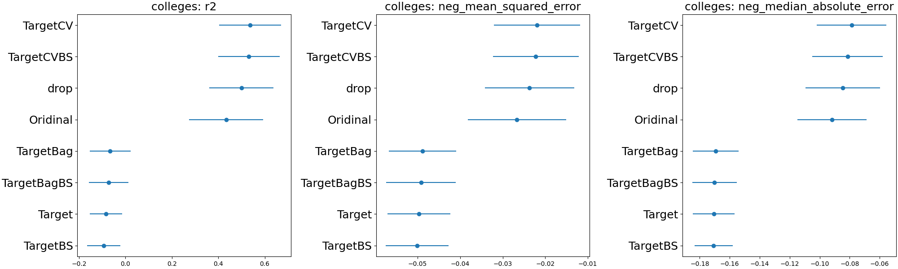
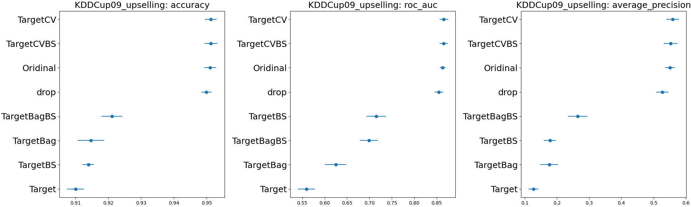

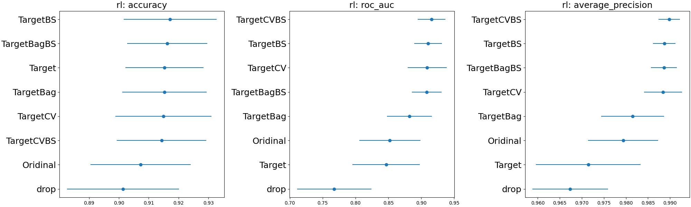


## How to run benchmarks

0. Clone repo:

```bash
git clone http://github.com/thomasjpfan/sk_encoder_cv
cd sk_encoder_cv
```

1. Create virtualenv and install `sk_encoder_cv`

```bash
conda create -n sk_encoder_cv python=3.8  # or use venv
conda activate sk_encoder_cv
python setup.py develop
```

2. Run single benchmarks:

```bash
python benchmark.py single adult
```

3. Or run all benchmarks

```bash
python benchmark.py all
```

The results will be written into the `results` directory.

4. Generate README report:

```bash
python generate_report.py
```
