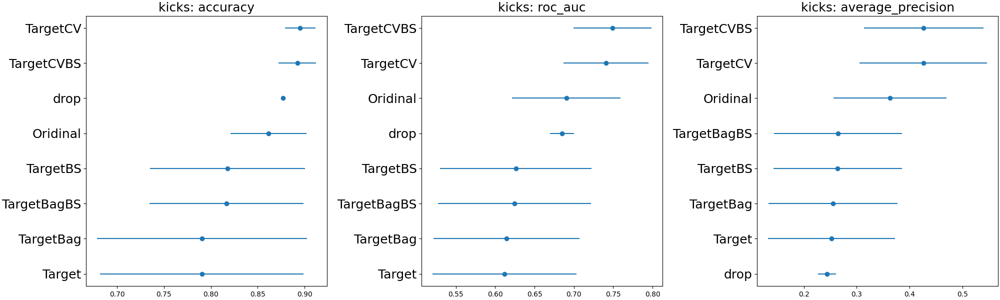
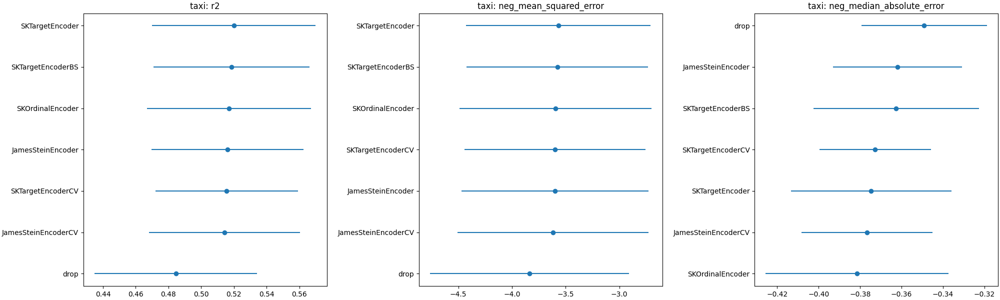
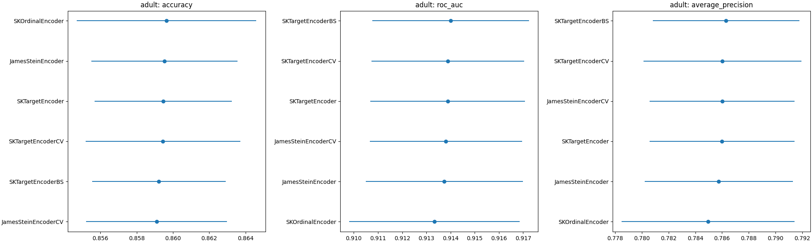

# Benchmarks for Target Encoder

Benchmarks for different forms of target encoder.

## Datasets

|    | dataset_name      |   categorical feaatures |   n_features |   n_samples | is_classification   | openml_url                     |
|---:|:------------------|------------------------:|-------------:|------------:|:--------------------|:-------------------------------|
|  0 | kicks             |                      18 |           32 |       72983 | True                | https://www.openml.org/d/41162 |
|  1 | amazon_access     |                       9 |            9 |       32769 | True                | https://www.openml.org/d/4135  |
|  2 | telco             |                      16 |           19 |        7043 | True                | https://www.openml.org/d/42178 |
|  3 | adult             |                      12 |           14 |       48842 | True                | https://www.openml.org/d/179   |
|  4 | ames              |                      43 |           79 |        1460 | False               | https://www.openml.org/d/42165 |
|  5 | taxi              |                       9 |           18 |      581835 | False               | https://www.openml.org/d/42729 |
|  6 | churn             |                       4 |           20 |        5000 | True                | https://www.openml.org/d/40701 |
|  7 | dresses_sales     |                      11 |           12 |         500 | True                | https://www.openml.org/d/23381 |
|  8 | phishing_websites |                      30 |           30 |       11055 | True                | https://www.openml.org/d/4534  |

## Results









## How to run benchmarks

0. Clone repo:

```bash
git clone http://github.com/thomasjpfan/sk_encoder_cv
cd sk_encoder_cv
```

1. Create virtualenv and install `sk_encoder_cv`

```bash
conda create -n sk_encoder_cv python=3.8  # or use venv
conda activate sk_encoder_cv
python setup.py develop
```

2. Run single benchmarks:

```bash
python benchmark.py --cv 5 --n-jobs 8 single adult SKTargetEncoder
```

3. Or run all benchmarks

```bash
python benchmark.py --cv 5 --n-jobs 8 all
```

The results will be written into the `results` directory.
